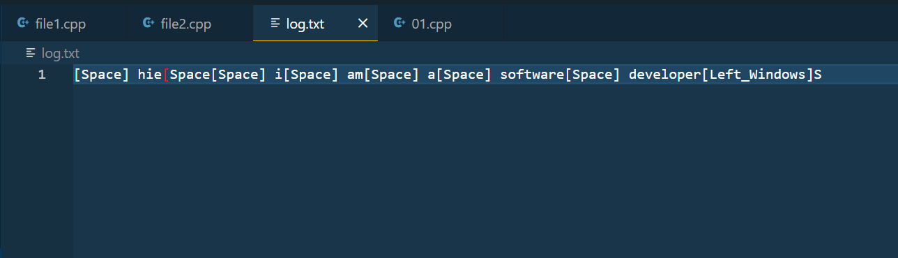

*) This project is based on keylogging, which involves capturing what a person types on a laptop using the
GetAsyncKeyState API from the Windows #include <Winuser.h> header file.

*)If the user types anything after running the program, a log.txt file will be created, and you can find the content there

*) if user types anything which is in your sensitive_words vector then alert.txt file is created and you can find the laert there that sensitive_word is typed.

*)the alert.txt file is also encrypted using vigenere Encryption algorithmn.

